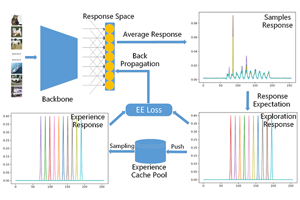

# Explore Visual Concept Formation for Image Classification
This repo contains the source code for the paper **Explore Visual Concept Formation for Image Classification** in International Conference on Machine Learning (ICML 2021). In this project, we provide the implementation of the proposed LSOVCF based on ResNet and cifar10, and the algorithm baased on other backbones and datasets can be implemented with simple modifications.

## About LSOVCF


The proposed learning strategy of concept formation. The backbone here can be any ConvNet, and response space is the last linear layer of the selected ConvNet. The backbones we adopted have been listed in [References](#references).

## Citation
If you find our code useful, please consider citing our work using the bibtex:
```
@inproceedings{
	author    = {Xiong, Sheng-Zhou  and Tan, Yi-Hua and Wang, Guo-You},
	title     = {Explore Visual Concept Formation for Image Classification},
	year      = {2021},
	booktitle     = {International Conference on Machine Learning},
}
```


## Enviroment
*  python 3.6 
*  pytorch 1.1.0
*  torchvision 0.3.0
*  cuda 9.0

## Hardware
* CPU: Intel(R) Core(TM) i9-9820X CPU @ 3.30GHz
* GPU: GeForce RTX 2080 Ti


## Getting started
* Change directory to ```./scripts```
* Run ```python ./main.py```

## <span id="references">References</span>
The implementations of the backbones that we used in the paper are available at the following links:
*  VGG:[https://github.com/pytorch/vision/blob/master/torchvision/models/vgg.py](https://github.com/pytorch/vision/blob/master/torchvision/models/vgg.py)
*  ResNet:[https://github.com/pytorch/vision/blob/master/torchvision/models/resnet.py](https://github.com/pytorch/vision/blob/master/torchvision/models/resnet.py)
*  SeNet:[https://github.com/moskomule/senet.pytorch](https://github.com/moskomule/senet.pytorch)
*  MobileNet v3:[https://github.com/d-li14/mobilenetv3.pytorch](https://github.com/d-li14/mobilenetv3.pytorch)
*  ShuffleNet v2:[https://github.com/Randl/ShuffleNetV2-pytorch](https://github.com/Randl/ShuffleNetV2-pytorch)
*  EfficientNet:[https://github.com/lukemelas/EfficientNet-PyTorch](https://github.com/lukemelas/EfficientNet-PyTorch)
*  GhostNet:[https://github.com/huawei-noah/CV-Backbones](https://github.com/huawei-noah/CV-Backbones)
